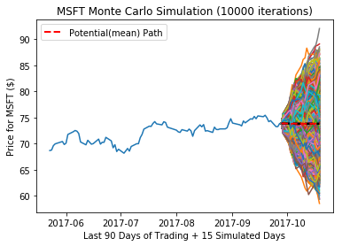

# MonteCarlo


```python
from MonteCarlo import RandomWalk
RandomWalk(sims = 10000)
```

    starting...
    connected to database
    attempting to download data
    downloaded data
    data stored and updated
    querying data
    data retrieved
    technical data calculated
    beginning simulation, 2.286097764968872 seconds after initation
    100%|██████████| 10000/10000 [03:53<00:00, 42.90it/s]
    Monte Carlo Simulation of MSFT Complete in 235.39665389060974 Seconds
    plotting...
    100%|██████████| 10000/10000 [01:23<00:00, 120.43it/s]



